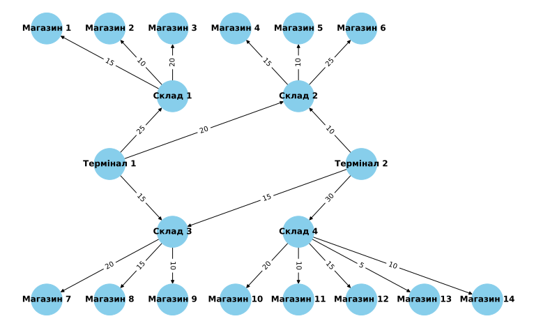

# Topic 3. Graphs and Trees
## Task 1. Application of the maximum flow algorithm for goods logistics

Develop a program to model the flow network for goods logistics from warehouses to stores using the maximum flow algorithm. Analyze the results and compare them with theoretical knowledge.



To draw graph
```bash
poetry run python .\app\logistic_draw.py
```